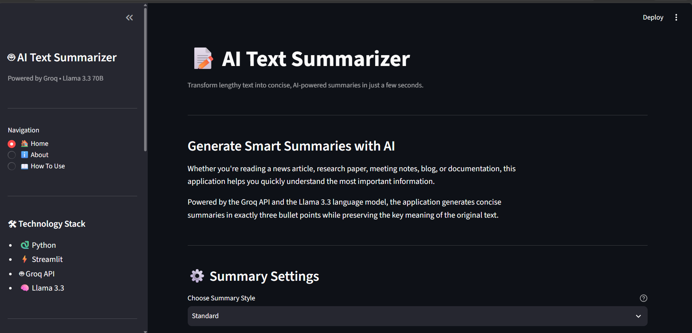
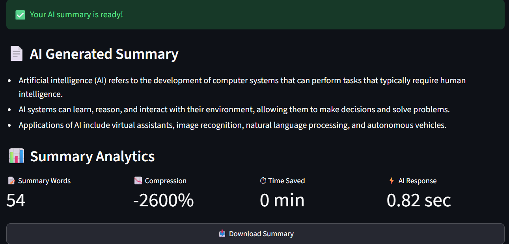
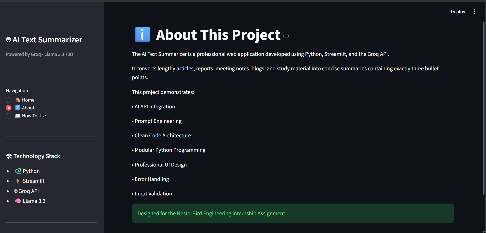

# 📝 AI Text Summarizer


> A professional AI-powered Text Summarization application built using **Python**, **Streamlit**, and the **Groq API**, designed to convert lengthy text into clear and concise summaries in exactly three bullet points.

---

# 🚀 Project Overview

Reading lengthy articles, reports, meeting notes, research papers, and blogs can be time-consuming. In many situations, users only need the most important information without reading the complete content.

The **AI Text Summarizer** solves this problem by leveraging the **Groq API** and the **Llama 3.3 70B Versatile** Large Language Model (LLM) to automatically generate concise summaries.

The application accepts long-form text as input and produces **exactly three meaningful bullet points** while preserving the key information from the original content.

This project demonstrates practical AI integration, prompt engineering, modular Python development, and clean software architecture through an easy-to-use Streamlit web application.

---

# 🎯 Project Objective

The primary objective of this project is to demonstrate how modern Large Language Models (LLMs) can be integrated into Python applications to automate text summarization while maintaining code readability, modularity, and scalability.

This project was developed as part of the **NestorBird Engineering Internship Assignment (2026)** to showcase:

- AI API Integration
- Prompt Engineering
- Clean Python Programming
- Modular Code Architecture
- Professional User Interface
- Error Handling
- Input Validation
- Environment Variable Management
- Real-world Software Development Practices

---

# 🌟 Key Features

The application includes the following features:

### 🤖 AI-Powered Text Summarization

Uses the **Groq API** with the **Llama 3.3 70B Versatile** model to generate intelligent summaries.

---

### 📌 Exactly Three Bullet Points

The AI is instructed through a carefully designed system prompt to always return **exactly three concise bullet points**.

---

### ⚙️ Multiple Summary Styles

Users can choose from multiple summary styles according to their needs.

- Standard
- Short
- Detailed
- Executive

---

### 📊 Live Text Statistics

The application automatically displays:

- Total Word Count
- Character Count
- Estimated Reading Time

These statistics update in real time as the user types.

---

### 📉 Compression Analysis

After generating the summary, the application calculates:

- Original Word Count
- Summary Word Count
- Compression Percentage

This helps users understand how much the content has been reduced.

---

### ⏱ Reading Time Saved

The application estimates how much reading time has been saved by using the generated summary.

---

### 📥 Download Summary

Users can download the generated summary as a plain text (.txt) file for future reference.

---

### ⚠️ Input Validation

The application validates user input before sending requests to the AI model.

Validation includes:

- Empty input detection
- Minimum word limit
- Maximum character limit

This improves reliability and prevents unnecessary API requests.

---

### 🧩 Modular Architecture

The application follows a clean modular structure by separating:

- User Interface
- AI Communication
- Configuration
- Utility Functions
- Prompt Engineering

into independent Python modules.

---

### 🎨 Professional User Interface

The application includes:

- Responsive layout
- Sidebar navigation
- About page
- How To Use page
- Live metrics
- Success and error messages
- Progress indicators

to provide a better user experience.

---

# 💡 Why This Project?

Large Language Models have become an important part of modern software development.

Instead of simply building another basic AI demo, this project focuses on creating a clean, production-style application that demonstrates:

- Practical AI Integration
- Prompt Engineering
- Software Architecture
- Code Organization
- User Experience Design

The goal is not only to generate summaries but also to build an application that follows professional development practices.

---

# 📷 Application Preview

> Screenshots will be added after deployment.


## 🏠 Home Page

<p align="center">
  
</p>

---

## 📄 Generated Summary

<p align="center">
  
</p>

---


## ℹ️ About Page

<p align="center">
  
</p>

---


## 📖 How To Use

<p align="center">
  
</p>

---


# 🛠 Technology Stack

This project is built using modern Python libraries and AI technologies to ensure clean architecture, maintainability, and efficient AI integration.

| Technology | Version | Purpose |
|------------|---------|---------|
| Python | 3.11+ | Core programming language |
| Streamlit | Latest | User Interface Framework |
| Groq API | Latest | AI inference service |
| Llama 3.3 70B Versatile | Latest | Large Language Model used for summarization |
| python-dotenv | Latest | Loads environment variables securely |
| Git | Latest | Version Control |
| GitHub | Latest | Source Code Repository |

---

# 📂 Project Directory Structure

The project follows a modular architecture where each file has a dedicated responsibility.

```text
AI-Text-Summarizer/
│
├── app.py
├── ai_service.py
├── utils.py
├── prompts.py
├── config.py
├── requirements.txt
├── .env
├── .gitignore
├── README.md
│
├── assets/
│   ├── logo.png
│   ├── banner.png
│   └── favicon.png
│
└── screenshots/
    ├── home.png
    ├── summary.png
    ├── about.png
    └── how_to_use.png
```

---

# 📁 File Description

Each file in this project has a single responsibility, making the code easier to understand, maintain, and extend.

---

## 📄 app.py

This is the main entry point of the application.

It is responsible for:

- Creating the Streamlit user interface
- Displaying the sidebar
- Managing page navigation
- Accepting user input
- Displaying live statistics
- Performing input validation
- Calling the AI service
- Displaying generated summaries
- Showing analytics
- Downloading summaries
- Managing Session State

This file does **not** contain AI logic. Instead, it communicates with `ai_service.py`, keeping the architecture clean.

---

## 🤖 ai_service.py

This file handles all communication with the Groq API.

Responsibilities include:

- Creating the Groq client
- Sending prompts to the AI model
- Receiving AI responses
- Handling API errors
- Returning clean summaries to the UI

Separating API logic from the user interface improves readability and maintainability.

---

## ⚙️ config.py

This file stores all configuration values used throughout the application.

Examples include:

- API Key
- AI Model Name
- Maximum Character Limit
- Minimum Word Limit

Keeping configuration in one place allows future changes without modifying application logic.

---

## 🧠 prompts.py

Prompt Engineering is separated into its own file.

This file contains:

- System Prompt
- Summary Prompt

Keeping prompts separate makes experimentation with different AI instructions much easier.

---

## 🧩 utils.py

This file contains reusable helper functions.

Examples include:

- Word Counter
- Character Counter
- Reading Time Calculator
- Compression Calculator
- Reading Time Saved
- Input Validation

Using utility functions reduces duplicate code and improves readability.

---

## 📄 requirements.txt

This file lists every Python package required to run the application.

Installing dependencies becomes as simple as:

```bash
pip install -r requirements.txt
```

---

## 🔐 .env

The `.env` file stores sensitive information such as the Groq API Key.

Example:

```env
GROQ_API_KEY=your_api_key_here
```

The API key is never hardcoded inside the application.

---

## 🚫 .gitignore

The `.gitignore` file prevents sensitive or unnecessary files from being uploaded to GitHub.

Examples include:

- .env
- venv/
- __pycache__/
- .pytest_cache/
- .idea/
- .vscode/

---

# 🏗 Project Architecture

The application follows a layered architecture.

```text
                 User
                   │
                   ▼
          Streamlit Interface
                 (app.py)
                   │
                   ▼
           Input Validation
              (utils.py)
                   │
                   ▼
            Prompt Selection
             (prompts.py)
                   │
                   ▼
          AI Communication
           (ai_service.py)
                   │
                   ▼
        Groq API + Llama 3.3
                   │
                   ▼
         AI Generated Summary
                   │
                   ▼
       Display Results in Streamlit
```

---

# 🔄 Application Flow

The following diagram explains how the application processes user input.

```text
User Opens Application
          │
          ▼
Paste Long Text
          │
          ▼
Input Validation
          │
          ▼
Choose Summary Style
          │
          ▼
Generate Summary Button
          │
          ▼
System Prompt Created
          │
          ▼
Groq API Request
          │
          ▼
Llama 3.3 AI Model
          │
          ▼
Three Bullet Summary Generated
          │
          ▼
Summary Displayed
          │
          ▼
Analytics Calculated
          │
          ▼
Download Summary
```

---

# 🎯 Design Principles

This project was designed using the following software engineering principles:

- Separation of Concerns (SoC)
- Modular Programming
- Reusable Functions
- Clean Code Practices
- Single Responsibility Principle (SRP)
- Environment Variable Security
- Maintainable Project Structure
- Readable Code Formatting

These principles make the project easier to maintain, test, and extend in the future.

# ⚙️ Installation Guide

This section explains how to set up and run the project on your local machine.

Even if you are new to Python or Streamlit, you can follow these steps without any prior experience.

---

# 📋 Prerequisites

Before running this project, make sure the following software is installed on your computer.

| Software | Recommended Version |
|-----------|---------------------|
| Python | 3.11 or later |
| Git | Latest Version |
| Visual Studio Code | Latest Version |
| Internet Connection | Required for Groq API |

---

# Step 1 — Install Python

Download Python from the official website.

https://www.python.org/downloads/

While installing Python, make sure to enable the following option:

✅ Add Python to PATH

After installation, verify it by opening Command Prompt or Terminal.

```bash
python --version
```

Expected Output

```text
Python 3.11.x
```

If Python is not recognized, restart your computer and verify that Python has been added to the system PATH.

---

# Step 2 — Install Git

Download Git from:

https://git-scm.com/downloads

Verify the installation.

```bash
git --version
```

Example Output

```text
git version 2.xx.x
```

---

# Step 3 — Clone the Repository

Open Command Prompt or Terminal.

Run:

```bash
git clone https://github.com/yourusername/AI-Text-Summarizer.git
```

Move into the project folder.

```bash
cd AI-Text-Summarizer
```

---

# Step 4 — Open the Project

Open the project using Visual Studio Code.

```bash
code .
```

You should now see the project files:

- app.py
- ai_service.py
- utils.py
- prompts.py
- config.py
- requirements.txt

---

# Step 5 — Create a Virtual Environment

Creating a virtual environment keeps project dependencies isolated from other Python projects.

Windows

```bash
python -m venv venv
```

Linux / macOS

```bash
python3 -m venv venv
```

---

# Step 6 — Activate the Virtual Environment

### Windows

```bash
venv\Scripts\activate
```

If activation is successful, your terminal will look similar to:

```text
(venv) C:\Projects\AI-Text-Summarizer>
```

### Linux / macOS

```bash
source venv/bin/activate
```

---

# Step 7 — Install Required Packages

Install all dependencies using the requirements file.

```bash
pip install -r requirements.txt
```

This installs:

- Streamlit
- Groq
- python-dotenv

Verify the installation.

```bash
pip list
```

---

# Step 8 — Create the Environment File

Inside the project folder, create a new file named:

```text
.env
```

Add your Groq API key.

```env
GROQ_API_KEY=YOUR_GROQ_API_KEY
```

Example

```env
GROQ_API_KEY=gsk_xxxxxxxxxxxxxxxxxxxxxxxxxxxxx
```

**Important:** Never upload your `.env` file to GitHub because it contains sensitive credentials.

---

# Step 9 — Obtain a Groq API Key

1. Visit the Groq Developer Console.
2. Sign in or create an account.
3. Navigate to the API Keys section.
4. Generate a new API key.
5. Copy the key.
6. Paste it into the `.env` file as shown above.

---

# Step 10 — Verify Configuration

Open `config.py` and confirm that the application loads the API key correctly.

Example:

```python
GROQ_API_KEY = os.getenv("GROQ_API_KEY")

MODEL_NAME = "llama-3.3-70b-versatile"

MIN_WORDS = 20

MAX_CHARACTERS = 5000
```

---

# Step 11 — Run the Application

Start the Streamlit server.

```bash
streamlit run app.py
```

If everything is configured correctly, the terminal will display:

```text
Local URL: http://localhost:8501
```

Open the URL in your web browser.

---

# Step 12 — Using the Application

Once the application opens:

1. Paste your text into the input area.
2. Select a summary style.
3. Click **Generate Summary**.
4. Wait for the AI to process the request.
5. Review the generated summary.
6. View the analytics section.
7. Download the summary as a text file.

---

# 🔍 Troubleshooting

### Problem: Python is not recognized

**Solution**

- Reinstall Python.
- Ensure "Add Python to PATH" is selected during installation.
- Restart the terminal.

---

### Problem: ModuleNotFoundError

Example:

```text
ModuleNotFoundError: No module named 'streamlit'
```

**Solution**

```bash
pip install -r requirements.txt
```

---

### Problem: API Key Error

Example:

```text
Authentication Error
```

**Solution**

- Verify that the `.env` file exists.
- Ensure the variable name is exactly:

```env
GROQ_API_KEY=your_api_key
```

- Confirm that the API key is valid and active.

---

### Problem: Streamlit Command Not Found

**Solution**

Run:

```bash
python -m streamlit run app.py
```

---

### Problem: Virtual Environment Not Activated

If the terminal does not display `(venv)` at the beginning, activate the environment again.

Windows

```bash
venv\Scripts\activate
```


---

# ✅ Installation Complete

If all the above steps have been completed successfully, the application is ready to use.

You can now generate AI-powered summaries, analyze text statistics, and download summaries directly from the Streamlit interface.

# ⚙️ Application Workflow

This section explains the complete working process of the AI Text Summarizer application from the moment a user enters text until the final summary is generated and displayed.

The application follows a structured workflow to ensure clean architecture, proper validation, and reliable AI-generated summaries.

---

# 🔄 High-Level Workflow

```
                User
                  │
                  ▼
         Enter Long Text
                  │
                  ▼
         Input Validation
                  │
                  ▼
       Select Summary Style
                  │
                  ▼
     Click Generate Summary
                  │
                  ▼
      Create AI Request
                  │
                  ▼
         Groq API Request
                  │
                  ▼
      Llama 3.3 70B Model
                  │
                  ▼
      AI Generates Summary
                  │
                  ▼
      Display Summary
                  │
                  ▼
      Calculate Analytics
                  │
                  ▼
      Download Summary
```

---

# 📋 Step-by-Step Workflow

## Step 1 — User Opens the Application

When the application starts, Streamlit initializes the user interface.

The following components are loaded:

- Sidebar
- Navigation
- Summary Settings
- Text Area
- Statistics Panel
- Action Buttons

At this stage, no AI request is sent.

---

## Step 2 — User Enters Text

The user pastes:

- Article
- Meeting Notes
- Research Paper
- Blog
- Documentation
- Paragraph

into the input text area.

Example

```
Artificial Intelligence is transforming the healthcare industry...
```

As the user types, the application immediately updates:

- Word Count
- Character Count
- Estimated Reading Time

These calculations are performed locally using utility functions.

---

## Step 3 — Input Validation

Before contacting the AI model, the application validates the input.

The validation checks:

- Empty input
- Minimum word limit
- Maximum character limit

Current limits:

```
Minimum Words : 20

Maximum Characters : 5000
```

If validation fails, an appropriate warning message is displayed and the AI request is cancelled.

This prevents unnecessary API usage.

---

## Step 4 — Select Summary Style

The user chooses one of the available summary styles.

Available options:

- Standard
- Short
- Detailed
- Executive

The selected option is passed to the AI service and influences the style of the generated summary.

---

## Step 5 — Generate Summary Button

Once the user clicks:

```
Generate Summary
```

the application performs the following operations:

1. Validates the input
2. Starts a loading spinner
3. Records the processing start time
4. Sends the request to the AI service

This ensures a smooth user experience while the AI is processing the request.

---

## Step 6 — Creating the AI Request

The application sends two messages to the language model.

### System Prompt

The System Prompt defines the behaviour of the AI.

Example responsibilities:

- Generate exactly three bullet points
- Focus only on important information
- Use simple English
- Do not add unnecessary explanations
- Avoid titles or introductions

---

### User Prompt

The User Prompt contains the text entered by the user.

For example:

```
Artificial Intelligence is rapidly changing healthcare...
```

---

## Step 7 — Groq API Communication

The request is sent to the Groq API.

The application uses the following configuration:

```
Model:
Llama 3.3 70B Versatile

Temperature:
0.3

Maximum Tokens:
250
```

The AI model processes the request and returns the generated summary.

---

## Step 8 — AI Response

The response received from Groq is returned to the application.

Example

```
• Artificial Intelligence improves medical diagnosis.

• AI reduces repetitive manual tasks.

• Healthcare organizations use AI to improve patient care.
```

The summary is stored in Session State so that it remains available even after Streamlit reruns the application.

---

## Step 9 — Display Summary

Once the response is received, the application displays:

✅ Success Message

AI Generated Summary

Formatted bullet points

The summary is displayed using Markdown for better readability.

---

## Step 10 — Analytics Calculation

After generating the summary, several useful statistics are calculated.

These include:

### Summary Word Count

Shows the total number of words in the generated summary.

---

### Compression Percentage

Calculates how much the original text has been reduced.

Formula

```
Compression %

=

(

1

−

Summary Words

Input Words

)

×

100
```

A higher percentage indicates greater reduction.

---

### Reading Time Saved

The application estimates how much reading time the user saves by reading the summary instead of the original text.

Reading speed is assumed to be approximately:

```
200 words per minute
```

---

## Step 11 — Download Summary

Users can download the generated summary.

Supported format:

```
summary.txt
```

This allows users to save or share the summary for future use.

---

# 🧠 AI Processing Pipeline

The following diagram illustrates the internal processing pipeline.

```
User Input
      │
      ▼
Input Validation
      │
      ▼
System Prompt
      │
      ▼
User Prompt
      │
      ▼
Groq API
      │
      ▼
Llama 3.3 Model
      │
      ▼
Generate Summary
      │
      ▼
Return Response
      │
      ▼
Display Summary
      │
      ▼
Calculate Metrics
      │
      ▼
Download Summary
```

---

# 📂 Internal Module Communication

The application is divided into independent modules.

```
app.py
   │
   ├────────► utils.py
   │             │
   │             ├── Word Count
   │             ├── Character Count
   │             ├── Reading Time
   │             ├── Compression
   │             └── Validation
   │
   ├────────► ai_service.py
   │             │
   │             ├── Connect Groq
   │             ├── Send Prompt
   │             ├── Receive Response
   │             └── Return Summary
   │
   ├────────► prompts.py
   │             │
   │             └── System Prompt
   │
   └────────► config.py
                 │
                 ├── API Key
                 ├── Model Name
                 ├── Min Words
                 └── Max Characters
```

---

# 🎯 Why This Workflow?

This workflow was designed to keep the application:

- Modular
- Easy to maintain
- Easy to debug
- Secure
- Scalable
- Beginner-friendly
- Professional

Each file has a single responsibility, reducing code duplication and making future enhancements easier.

---

# ✅ Summary of Workflow

The AI Text Summarizer follows a clean and structured process:

1. User enters text.
2. Input is validated.
3. Summary style is selected.
4. A carefully designed system prompt is prepared.
5. The request is sent to the Groq API.
6. The Llama 3.3 model generates a summary.
7. The application displays the result.
8. Analytics are calculated.
9. The user downloads the summary if required.

This workflow demonstrates practical AI integration using modern Python development practices and clean software architecture.

# 📁 Project Files Explained

The project follows a modular architecture where each file has a single responsibility.

Instead of writing the entire application in one file, the project is divided into multiple modules. This makes the code more readable, reusable, maintainable, and scalable.

Each module performs one specific task and communicates with the others whenever required.

---

# 📄 app.py

## Purpose

`app.py` is the main entry point of the application.

Whenever the application starts using the following command:

```bash
streamlit run app.py
```

Streamlit executes this file first.

This file is responsible for building the complete user interface and controlling the application's workflow.

---

## Responsibilities

The responsibilities of `app.py` include:

- Creating the Streamlit page
- Configuring the application
- Building the sidebar
- Managing page navigation
- Displaying the Home page
- Displaying the About page
- Displaying the How To Use page
- Accepting user input
- Displaying text statistics
- Performing input validation
- Calling the AI service
- Displaying generated summaries
- Showing analytics
- Downloading summaries
- Managing session state

---

## Why is UI separated from AI?

The user interface should only focus on interaction with the user.

The AI communication is handled inside **ai_service.py**.

This separation follows the **Single Responsibility Principle (SRP)** and makes the code much easier to maintain.

---

# 🤖 ai_service.py

## Purpose

This file handles all communication with the Groq API.

Instead of placing API requests inside `app.py`, all AI-related operations are centralized in this module.

---

## Responsibilities

The file performs the following tasks:

- Creates the Groq client
- Sends prompts to the language model
- Receives AI responses
- Handles API exceptions
- Returns clean summaries

---

## Why separate API logic?

Suppose you later replace Groq with:

- OpenAI
- Gemini
- Claude
- Mistral

Only `ai_service.py` needs to be updated.

The remaining project remains unchanged.

This improves maintainability and scalability.

---

# ⚙️ config.py

## Purpose

The configuration file stores all application settings in one place.

Instead of hardcoding values throughout the project, they are managed centrally.

---

## Configuration Values

The configuration currently stores:

- Groq API Key
- Model Name
- Minimum Word Limit
- Maximum Character Limit

Example

```python
MODEL_NAME

MIN_WORDS

MAX_CHARACTERS
```

---

## Why use a configuration file?

Without a configuration file:

Every change would require searching multiple files.

With a configuration file:

Only one file needs to be updated.

This is considered a professional software development practice.

---

# 🧠 prompts.py

## Purpose

Prompt Engineering is one of the most important parts of any AI application.

Instead of writing prompts directly inside the API request, they are stored separately.

---

## Current Prompts

The project contains:

- System Prompt
- Summary Prompt

---

## Why separate prompts?

Keeping prompts in their own file provides several benefits:

- Easier prompt modification
- Better readability
- Cleaner AI logic
- Easier experimentation
- Improved maintainability

---

## Example Responsibility

The System Prompt instructs the AI to:

- Generate exactly three bullet points
- Focus on important information
- Use simple English
- Avoid unnecessary explanations
- Return only the summary

This ensures consistent AI responses.

---

# 🧩 utils.py

## Purpose

The `utils.py` file contains reusable helper functions.

Instead of writing the same logic multiple times, common operations are stored here.

---

## Utility Functions

Examples include:

- Word Counter
- Character Counter
- Reading Time Calculator
- Compression Calculator
- Reading Time Saved
- Input Validation

---

## Why use utility functions?

Benefits include:

- Less duplicate code
- Better readability
- Easier debugging
- Reusable logic
- Cleaner application structure

---

## Example

Instead of writing:

```python
len(text.split())
```

multiple times,

the application simply calls:

```python
count_words(text)
```

This improves readability.

---

# 📦 requirements.txt

## Purpose

This file contains all Python dependencies required to run the application.

Instead of manually installing packages one by one, everything can be installed with a single command.

```bash
pip install -r requirements.txt
```

---

## Benefits

- Faster setup
- Easy deployment
- Version consistency
- Simple dependency management

---

# 🔐 .env

## Purpose

The `.env` file stores sensitive information such as API keys.

Example

```env
GROQ_API_KEY=your_api_key
```

---

## Why not hardcode API keys?

Hardcoding secrets is a security risk.

Using environment variables keeps credentials secure and prevents accidental exposure on GitHub.

---

# 🚫 .gitignore

## Purpose

This file prevents unnecessary or sensitive files from being uploaded to GitHub.

Typical entries include:

- .env
- venv/
- __pycache__/
- .idea/
- .vscode/

---

## Why is it important?

It keeps the repository:

- Clean
- Secure
- Professional

It also prevents large or sensitive files from being committed accidentally.

---

# 🔄 How All Files Work Together

The project follows a layered architecture.

```
User
 │
 ▼
app.py
 │
 ├────────► utils.py
 │
 ├────────► ai_service.py
 │
 ├────────► prompts.py
 │
 └────────► config.py
            │
            ▼
        Groq API
            │
            ▼
      Llama 3.3 Model
            │
            ▼
      Generated Summary
            │
            ▼
          app.py
            │
            ▼
      Display to User
```

---

# 🎯 Design Philosophy

While developing this project, the following software engineering principles were followed:

- Modular Programming
- Clean Code Practices
- Separation of Concerns (SoC)
- Single Responsibility Principle (SRP)
- Reusability
- Readability
- Maintainability
- Scalability
- Secure Configuration Management

These principles make the application easier to understand, easier to maintain, and ready for future enhancements.

# 🎨 User Interface (UI) Walkthrough

The AI Text Summarizer has been designed with a clean, modern, and user-friendly interface.

Instead of placing all components on a single page, the application organizes information into logical sections, making it easier for users to navigate and interact with the application.

The interface is built using **Streamlit**, which provides a responsive and interactive web application without requiring HTML, CSS, or JavaScript.

---

# 🏠 Home Page

The **Home** page is the main working area of the application.

It contains everything required to generate AI-powered summaries.

The user workflow begins here.

The Home page includes:

- Application Header
- Project Description
- Summary Settings
- Input Text Area
- Live Text Statistics
- Generate Button
- Clear Button
- AI Generated Summary
- Summary Analytics
- Download Summary Button

---

# 📌 Application Header

At the top of the application, the project title is displayed.

Example:

```
📝 AI Text Summarizer
```

A short caption is also shown below the title.

Example:

```
Convert long paragraphs into concise AI-powered summaries in seconds.
```

This immediately informs users about the purpose of the application.

---

# 📑 Sidebar Navigation

The sidebar acts as the application's navigation panel.

It allows users to switch between different sections without leaving the application.

Current navigation options include:

```
🏠 Home

ℹ️ About

📖 How To Use
```

This keeps the interface organized and easy to explore.

---

# ℹ️ About Page

The About page provides background information about the project.

It explains:

- Project objective
- AI model used
- Technologies used
- Development purpose
- Assignment information

This section helps interviewers and users understand the motivation behind the project.

---

# 📖 How To Use Page

The How To Use page provides a step-by-step guide for first-time users.

Typical workflow:

1. Paste text.
2. Select summary style.
3. Click Generate Summary.
4. Read the AI-generated summary.
5. Download the summary.

This improves usability and reduces confusion.

---

# ⚙️ Summary Settings

Before generating a summary, users can choose a summary style.

Available options:

- Standard
- Short
- Detailed
- Executive

Each style instructs the AI to generate summaries with a slightly different level of detail while maintaining exactly three bullet points.

---

# 📝 Text Input Area

The input section allows users to paste any long text.

Examples include:

- Articles
- Blogs
- Reports
- Research Papers
- Meeting Notes
- Documentation
- Study Material

The text area supports large inputs while maintaining a clean layout.

Placeholder text guides the user before input is entered.

---

# 📊 Live Text Statistics

As the user types, the application automatically calculates useful statistics.

The statistics update in real time without requiring any button clicks.

Displayed metrics include:

### 📝 Word Count

Shows the total number of words entered by the user.

---

### 🔠 Character Count

Displays the total number of characters in the input text.

This helps users stay within the maximum character limit.

---

### ⏱ Estimated Reading Time

Estimates how many minutes it would take to read the original text.

The calculation assumes an average reading speed of approximately 200 words per minute.

---

# 📈 Character Progress Bar

The application displays a progress bar indicating how much of the maximum character limit has been used.

Example:

```
2750 / 5000 Characters
```

Benefits:

- Prevents exceeding the limit
- Gives visual feedback
- Improves user experience

---

# 🚀 Generate Summary Button

After entering valid text, the user clicks:

```
🚀 Generate Summary
```

The application then:

- Validates input
- Shows a loading spinner
- Sends the request to Groq AI
- Receives the AI response
- Displays the generated summary

---

# 🧹 Clear Text Button

The Clear button resets the application.

When clicked, it:

- Clears the text area
- Removes the generated summary
- Resets session data
- Refreshes the interface

This allows users to start a new summarization session quickly.

---

# ⏳ Loading Spinner

During AI processing, the application displays a loading spinner.

Example:

```
Generating AI summary...
```

This informs users that the request is currently being processed.

Providing visual feedback improves user experience and prevents repeated button clicks.

---

# 📄 AI Generated Summary

After the AI finishes processing, the generated summary is displayed.

The summary:

- Contains exactly three bullet points
- Uses Markdown formatting
- Is easy to read
- Preserves the key ideas of the original text

A success message confirms that the summary has been generated successfully.

---

# 📉 Summary Analytics

Once the summary is displayed, additional analytics are calculated.

These include:

### Summary Word Count

Displays the number of words in the generated summary.

---

### Compression Percentage

Shows how much the original text has been reduced.

Example:

```
Original Text

↓

500 Words

↓

Summary

↓

90 Words

↓

Compression = 82%
```

---

### Reading Time Saved

Displays the estimated reading time saved by reading the summary instead of the full text.

This provides users with a measurable benefit of using the application.

---

# 📥 Download Summary

Users can download the generated summary as a plain text file.

Example filename:

```
summary.txt
```

Benefits include:

- Easy sharing
- Offline access
- Record keeping
- Documentation

---

# ⚠️ Validation Messages

The application provides clear feedback whenever invalid input is detected.

Examples include:

- Empty text
- Input below minimum word limit
- Input exceeding maximum character limit

These messages guide users and prevent unnecessary API requests.

---

# 📱 Responsive Layout

The interface uses Streamlit's responsive layout system.

It automatically adjusts based on screen size, making it usable on:

- Desktop Computers
- Laptops
- Tablets

The layout remains clean and readable across different devices.

---

# 🎯 User Experience Goals

The interface was designed with the following objectives:

- Simple navigation
- Minimal learning curve
- Professional appearance
- Fast interaction
- Clear feedback
- Readable typography
- Logical layout
- Beginner-friendly design

Every UI component has a specific purpose, ensuring that users can generate AI summaries quickly and efficiently without unnecessary complexity.

# ⚙️ Functions and Code Explanation

To keep the application clean and maintainable, commonly used operations are separated into reusable functions. Each function has a single responsibility, making the code easier to understand, debug, and extend.

---

# 📂 Functions in utils.py

The `utils.py` file contains helper functions that are reused throughout the application.

---

## 1️⃣ count_words()

### Purpose

Counts the total number of words entered by the user.

### Why is it needed?

Instead of manually counting words every time, this reusable function keeps the code simple and avoids duplication.

### How it works

It splits the input text wherever a space occurs and counts the resulting words.

Example:

Input:

```
Python is easy to learn.
```

Output:

```
5
```

Used in:

- Live Word Counter
- Compression Analysis
- Reading Time Calculation

---

## 2️⃣ count_characters()

### Purpose

Calculates the total number of characters in the user's input.

### Why is it needed?

The application limits the maximum number of characters that can be processed.

This function helps:

- Display live character count
- Update the progress bar
- Prevent exceeding the allowed limit

Example

Input

```
Hello World
```

Output

```
11 Characters
```

---

## 3️⃣ estimate_reading_time()

### Purpose

Estimates how many minutes it would take to read the original text.

### Logic

The calculation assumes an average reading speed of:

```
200 Words per Minute
```

Formula

```
Reading Time

=

Total Words

÷

200
```

Example

```
400 Words

↓

2 Minutes
```

### Why is this useful?

Users immediately know approximately how long the original content would take to read.

---

## 4️⃣ calculate_compression()

### Purpose

Calculates how much the text has been reduced after summarization.

### Formula

```
Compression %

=

(

1

−

Summary Words

Input Words

)

×

100
```

Example

```
Input Words

500

↓

Summary Words

100

↓

Compression

80%
```

### Why is this important?

Compression percentage helps users understand how concise the generated summary is.

---

## 5️⃣ reading_time_saved()

### Purpose

Calculates how much reading time the summary saves.

### Example

Original Reading Time

```
6 Minutes
```

Summary Reading Time

```
1 Minute
```

Output

```
Time Saved

5 Minutes
```

### Benefit

This metric provides a practical measurement of the usefulness of the summarizer.

---

## 6️⃣ validate_input()

### Purpose

Checks whether the user's input satisfies all application rules before sending a request to the AI model.

### Validation Rules

The application verifies:

- Input is not empty
- Minimum word limit is met
- Maximum character limit is not exceeded

Current Limits

```
Minimum Words

20
```

```
Maximum Characters

5000
```

### Why validate input?

Validation prevents:

- Empty API requests
- Unnecessary API usage
- Invalid user input
- Poor quality summaries

---

# 🤖 Function in ai_service.py

---

## generate_summary()

### Purpose

This is the core AI function of the application.

It communicates with the Groq API and returns the AI-generated summary.

---

### Responsibilities

This function performs the following tasks:

- Accepts user input
- Accepts selected summary style
- Sends the System Prompt
- Sends the User Prompt
- Calls the Groq API
- Receives the AI response
- Returns the generated summary
- Handles API errors

---

### Internal Workflow

```
User Text

↓

System Prompt

↓

Summary Style

↓

Groq API

↓

Llama 3.3

↓

Generated Summary
```

---

### Why keep this function separate?

Separating AI communication from the UI provides several advantages:

- Cleaner architecture
- Better readability
- Easier debugging
- Easier model replacement
- Improved maintainability

---

# ⚙️ Configuration Variables

The application stores configuration values inside `config.py`.

---

## GROQ_API_KEY

Stores the API key securely using environment variables.

Purpose:

Authenticate requests sent to Groq.

---

## MODEL_NAME

Specifies which language model should be used.

Current Model

```
llama-3.3-70b-versatile
```

Keeping the model name in one place makes future upgrades easy.

---

## MIN_WORDS

Defines the minimum number of words required before a summary can be generated.

Current Value

```
20
```

---

## MAX_CHARACTERS

Defines the maximum number of characters allowed.

Current Value

```
5000
```

---

# 🧠 Prompt Engineering

The project stores prompts separately inside `prompts.py`.

This improves readability and allows prompts to be modified without changing the application logic.

---

## SYSTEM_PROMPT

The System Prompt defines how the AI should behave.

Responsibilities include:

- Generate exactly three bullet points
- Focus on important information
- Use simple English
- Avoid titles
- Avoid introductions
- Avoid conclusions

Because of this prompt, every response remains consistent.

---

# 🖥️ Important Streamlit Components

The application uses several important Streamlit components.

---

## st.text_area()

Used to collect long-form user input.

Examples include:

- Articles
- Blogs
- Meeting Notes
- Research Papers

---

## st.button()

Used for interactive actions.

Buttons include:

- Generate Summary
- Clear Text

---

## st.metric()

Displays numerical statistics in a professional format.

Used for:

- Word Count
- Character Count
- Reading Time
- Compression
- Time Saved

---

## st.progress()

Displays a visual progress bar representing the character usage.

This gives immediate feedback to users as they type.

---

## st.spinner()

Displays a loading animation while the AI is generating the summary.

This improves user experience by indicating that processing is in progress.

---

## st.success()

Displays a success message after a summary has been generated successfully.

---

## st.warning()

Displays validation messages when the input is invalid.

---

## st.error()

Displays user-friendly error messages if the AI request fails.

---

## st.download_button()

Allows users to download the generated summary as a `.txt` file.

This makes the summary easy to save, share, or use later.

---

# 🎯 Why These Functions Matter

Instead of writing all logic inside one large file, the application is divided into small, reusable functions.

This approach provides several benefits:

- Improved readability
- Easier debugging
- Better maintainability
- Higher code reusability
- Cleaner architecture
- Simpler future enhancements

By following modular programming principles, the project becomes easier to understand for both developers and interviewers while also being more scalable for future development.

# 🧠 AI Design Decisions & Prompt Engineering

Artificial Intelligence is the core component of this project. Instead of using default settings, careful design decisions were made to ensure that the generated summaries are accurate, concise, and consistent.

This section explains why specific AI technologies, prompts, and model parameters were selected.

---

# 🤖 Why Groq API?

The application uses the **Groq API** as the AI inference provider.

Groq was selected because it offers:

- Extremely fast inference speed
- Low response latency
- Reliable API performance
- Easy integration with Python
- Support for modern Large Language Models (LLMs)

For an interactive Streamlit application, response speed is important because users expect summaries to be generated within a few seconds. Groq provides an excellent balance between speed and accuracy.

---

# 🧠 Why Llama 3.3 70B Versatile?

The application uses the following model:

```
llama-3.3-70b-versatile
```

This model was selected because it performs well on:

- Text summarization
- Information extraction
- Reasoning tasks
- Long-form text understanding
- Instruction following

Since this project focuses on generating high-quality summaries, the model's ability to understand context and follow instructions consistently makes it a suitable choice.

---

# 🎯 Prompt Engineering

Prompt Engineering is one of the most important aspects of any AI-powered application.

Instead of relying on the model's default behavior, a carefully designed **System Prompt** is used to guide the AI.

The prompt defines:

- The role of the AI
- The expected output format
- Writing style
- Response constraints

This approach produces more consistent and predictable summaries.

---

# 📄 System Prompt

The application sends a System Prompt before the user's text.

The prompt instructs the model to:

- Act as a text summarization assistant
- Focus only on the most important information
- Generate exactly three bullet points
- Use simple and clear English
- Avoid titles
- Avoid introductions
- Avoid conclusions
- Return only the summary

Because every request starts with the same instructions, the AI behaves consistently across different inputs.

---

# 👤 User Prompt

After the System Prompt, the application sends the user's original text.

Example:

```
User Input

↓

Artificial Intelligence is rapidly changing healthcare by improving diagnosis, reducing repetitive work, and assisting doctors with data-driven insights.
```

The model combines the System Prompt with the User Prompt to generate the final summary.

---

# 🌡️ Temperature Setting

The application uses:

```
Temperature = 0.3
```

### Why?

The temperature parameter controls how creative or random the AI response should be.

Lower values produce more focused and deterministic responses.

Higher values generate more creative but less predictable outputs.

For a summarization application, consistency is more important than creativity.

Therefore, a value of **0.3** was chosen to ensure that summaries remain accurate and stable.

---

# 📏 Maximum Tokens

The application uses:

```
max_tokens = 250
```

### Why?

The `max_tokens` parameter limits the maximum length of the AI response.

Since the application is designed to generate exactly three concise bullet points, a limit of 250 tokens is more than sufficient.

This also helps:

- Reduce response time
- Avoid unnecessarily long outputs
- Control API usage

---

# 💬 Message Structure

Every API request contains two messages.

### 1. System Message

Defines the AI's behavior and response rules.

---

### 2. User Message

Contains the text entered by the user.

Example structure:

```
System Message
        │
        ▼
User Message
        │
        ▼
Groq API
        │
        ▼
Llama 3.3
        │
        ▼
Generated Summary
```

This structured conversation helps the model understand both **what it should do** and **what content it should summarize**.

---

# 🎨 Summary Styles

The application provides multiple summary styles:

- Standard
- Short
- Detailed
- Executive

These options allow users to choose a summary style that best matches their needs.

For example:

### Standard

Balanced summary with key information.

---

### Short

Very concise summary while preserving the main idea.

---

### Detailed

Includes slightly more context while remaining concise.

---

### Executive

Focuses on high-level insights suitable for business or professional readers.

The selected style is passed to the AI service so the generated summary aligns with the user's preference.

---

# ⚠️ Input Validation Before AI Request

Before contacting the AI model, the application validates the user's input.

The request is sent only if:

- The input is not empty
- The minimum word requirement is met
- The maximum character limit is not exceeded

This improves reliability and prevents unnecessary API requests.

---

# 🛡️ Error Handling

The AI request is wrapped inside a `try-except` block.

This ensures that unexpected issues, such as network errors or API failures, are handled gracefully.

Instead of displaying technical error messages, the application shows a clear and user-friendly message.

This improves the overall user experience.

---

# 🔄 AI Request Lifecycle

The complete AI request lifecycle is shown below:

```
User Enters Text
        │
        ▼
Input Validation
        │
        ▼
Select Summary Style
        │
        ▼
Create System Prompt
        │
        ▼
Create User Prompt
        │
        ▼
Groq API Request
        │
        ▼
Llama 3.3 Model
        │
        ▼
Generate Summary
        │
        ▼
Return Response
        │
        ▼
Display Summary
```

---

# 💡 Design Philosophy

The AI component of this project was designed with the following goals:

- Accuracy over creativity
- Consistent output format
- Fast response time
- Simple user experience
- Reliable summarization
- Clean architecture
- Maintainable prompt design

By separating prompt engineering, AI communication, configuration, and user interface into independent modules, the application remains scalable and easier to maintain as new features or models are introduced.

# 🚀 Future Improvements

Although the current version of the AI Text Summarizer is fully functional and production-ready for the internship assignment, several enhancements can be added in future versions.

Some possible improvements include:

## 🌍 Multiple Language Support

Allow users to summarize text in different languages such as:

- English
- Hindi
- Spanish
- French
- German

This would make the application useful for a wider audience.

---

## 📄 PDF Upload Support

Instead of pasting text manually, users could upload PDF documents.

The application would:

- Extract text
- Process the content
- Generate the summary automatically

---

## 📑 DOCX File Support

Users could upload Microsoft Word documents directly.

This feature would improve usability for business and academic users.

---

## 📋 Copy to Clipboard

Currently, users can download summaries.

A future version could include a **Copy Summary** button for one-click copying.

---

## 🎯 Adjustable Summary Length

Instead of fixed summaries, users could select:

- 3 Bullet Points
- 5 Bullet Points
- Paragraph Summary
- One-line Summary

---

## 📊 AI Quality Score

A future version could estimate:

- Summary Quality
- Readability Score
- Information Coverage

using AI evaluation techniques.

---

## 📚 Summary History

Store previous summaries so users can revisit earlier work without regenerating them.

---

## 🌙 Dark Mode

Support both:

- Light Theme
- Dark Theme

to improve accessibility and user preference.

---

## ☁️ Cloud Deployment

The application can be deployed using:

- Streamlit Community Cloud
- Render
- Railway
- Hugging Face Spaces
- AWS
- Azure

making it accessible online.

---

# ⚠️ Challenges Faced During Development

During development, several practical challenges were encountered.

These challenges helped improve debugging skills and understanding of AI integration.

Some of the major challenges included:

- Setting up the Groq API correctly
- Managing environment variables securely
- Understanding Streamlit Session State
- Designing a reusable project structure
- Writing effective system prompts
- Handling API exceptions gracefully
- Maintaining clean and modular code
- Creating a responsive user interface

Each challenge was resolved through testing, documentation, and incremental improvements.

---

# 🧪 Testing

The application was manually tested using different types of input to ensure reliability.

### Test Cases

✅ Short paragraphs

✅ Long articles

✅ Research papers

✅ Meeting notes

✅ Empty input

✅ Invalid input

✅ Maximum character limit

✅ Minimum word limit

✅ Download summary

All core features performed successfully during testing.

---

# 📌 Current Limitations

Although the application performs well, a few limitations exist.

- Requires an internet connection.
- Requires a valid Groq API key.
- Supports text input only.
- Does not summarize images or scanned PDFs.
- Summary quality depends on the quality of the input text.

These limitations can be addressed in future versions.

---

# 💡 Key Learning Outcomes

This project helped strengthen knowledge in several important areas.

Technical skills developed include:

- Python Programming
- Streamlit Application Development
- REST API Integration
- Prompt Engineering
- Environment Variable Management
- Error Handling
- Modular Programming
- Clean Code Practices
- User Interface Design
- AI Application Development

In addition to technical skills, the project also improved problem-solving, debugging, and software design abilities.

---

# 🙏 Acknowledgements

This project was developed as part of the **NestorBird Engineering Internship Assignment 2026**.

Special thanks to:

- **Groq** for providing fast AI inference.
- **Meta** for the Llama 3.3 language model.
- **Streamlit** for enabling rapid web application development.
- The **Python community** for maintaining high-quality open-source libraries.

---

# 📜 License

This project is intended for educational and demonstration purposes.

You are free to study, modify, and extend the project for learning.

If you use this project publicly, appropriate credit is appreciated.

---

# 👨‍💻 Author

**Nikhil Rana**

BCA Graduate

Python Developer | AI Enthusiast | Data Analyst

Developed as part of the **NestorBird Engineering Internship Assignment (2026)**

---

# 🎯 Project Highlights

✔ Clean and modular architecture

✔ Professional Streamlit user interface

✔ Secure API integration using environment variables

✔ Prompt engineering for consistent AI responses

✔ Live analytics and text statistics

✔ Multiple summary styles

✔ Input validation

✔ Downloadable summaries

✔ Beginner-friendly and maintainable codebase

✔ Well-documented project structure

---

# 📌 Conclusion

The AI Text Summarizer demonstrates how modern Large Language Models can be integrated into a Python application to solve a real-world problem.

The project follows clean software engineering principles by separating user interface, business logic, configuration, utility functions, and AI communication into independent modules.

Beyond generating concise summaries, the application provides useful analytics such as word count, reading time estimation, compression percentage, and reading time saved, enhancing the overall user experience.

This project reflects practical experience in AI integration, Python development, Streamlit application design, prompt engineering, API handling, and modular programming.

It serves as a strong demonstration of building an end-to-end AI-powered application with a focus on maintainability, usability, and clean architecture.

---

# ⭐ Thank You

Thank you for reviewing this project.

Your feedback is always appreciated.

If you found this project useful, consider giving it a ⭐ on GitHub.